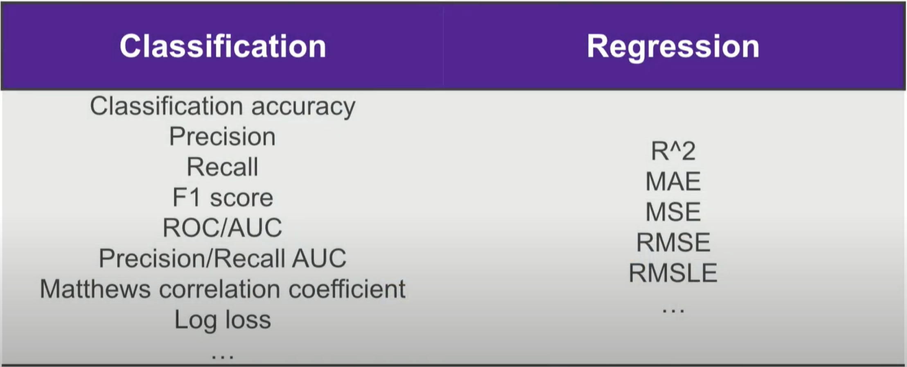
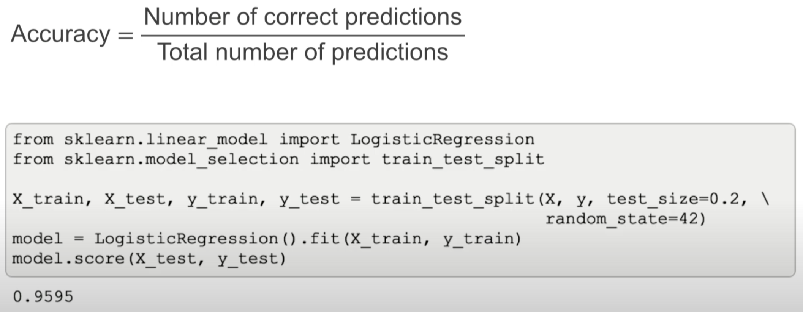

# Machine Learning Applications #

**Process**

- Determine the proper **model** (evaluation) **metric** to use based on the type of response variable & business problem to-solve.
  - Additionally, how to communicate the model's performance to stakeholders.
- Determine the optimal tuning of your model's **hyperparameter**.
  - You set the value of a hyperparameter prior to training your model to determine its _learning process_.

## Machine Learning Model Evaluation Metrics ## 

Notes based on the AnacondaCon [video](https://www.youtube.com/watch?v=wpQiEHYkBys)

**Evaluation Metrics**

- Why're there so many?
- What's the point?
- What's the difference?
- What do they mean?

**Definition**

An evaluation metric is a way to quantify the performance of a machine learning model.

- It's a number that tells you if it's any good.
  - This number can be used to compare different models.
  
It's not the same as loss function: It can be, but it doesn't have to be.

- Loss function is used while training your model or optimizing it.
- Evaluation metric is used on an already trained machine learning model to see the result: if it's any good.

| **Supervised Learning Metrics** |
| :-: |
|  |

**Classification Metrics**

Binary Classification

- Accuracy = Number of correct predictions / Total number of predictions
  - Ranges from 0 to 100% (or 0 to 1)
  
| Accuracy in scikit-learn is accessed via score() method |
| :-: |
|  |

