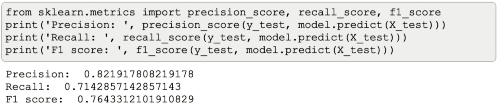
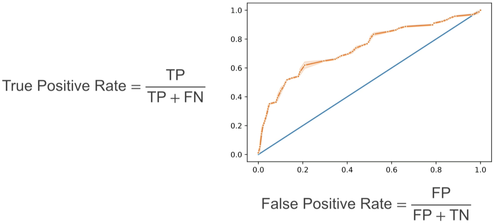
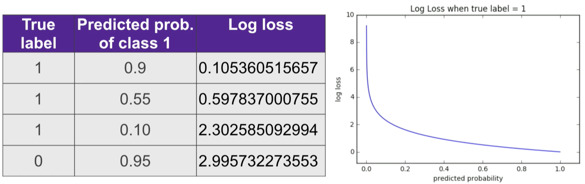

# Machine Learning Applications #

**Process**

- Determine the proper **model** (evaluation) **metric** to use based on the type of response variable & business problem to-solve.
  - Additionally, how to communicate the model's performance to stakeholders.
- Determine the optimal tuning of your model's **hyperparameter**.
  - You set the value of a hyperparameter prior to training your model to determine its _learning process_.

## Machine Learning Model Evaluation Metrics ## 

Notes based on the AnacondaCon [video](https://www.youtube.com/watch?v=wpQiEHYkBys) of [Maria Khalusova](https://twitter.com/mariakhalusova){target="_blank"}

**Evaluation Metrics**

- Why're there so many?
- What's the point?
- What's the difference?
- What do they mean?

**Definition**

An evaluation metric is a way to quantify the performance of a machine learning model.

- It's a number that tells you if it's any good.
  - This number can be used to compare different models.
  
It's not the same as loss function: It can be, but it doesn't have to be.

- Loss function is used while training your model or optimizing it.
- Evaluation metric is used on an already trained machine learning model to see the result: if it's any good.

| Supervised Learning Metrics |
| :-: |
|  |

### Classification Metrics (Binary) ###

**Accuracy**

- Accuracy = Number of correct predictions / Total number of predictions
  - Ranges from 0 to 100% (or 0 to 1)
  
| Accuracy in scikit-learn is accessed via score() method |
| :-: |
|  |

- Even though you're getting close to 96% accuracy, it may not necessarily be a good thing.
  - The data can be class imbalanced, with 95% of examples being positive (label) and 5% negative.
    - Which means that if all the values are coded as positive (label) then you'd get 95% accuracy.

| If we don't know what our data looks like we can't say if 96% is good number |
| :-: |
|  |

- From just the accuracy score we can't know what errors the model is doing nor how to improve it.

**Confusion Matrix**

A table (matrix) that gives you numbers of how many samples your model classified correctly for what they are and how it mistook for something else.

- Technically not a metric, more of a diagnostic tool.
- It helps to gain insight into the type of errors a model is making.
- It also helps to understand other metrics that're derived from it.

| Confusino Matrix in scikit-learn: frst, pass actual values then predictions |
| :-: |
|  |
| Confusion Matrix table: rows = actual values, columns = predicted values |
|  |
| True Negative [Upper Left] values were predicted negative and they were negative.   True Positive [Lower Right] were predicted positive and they actually were positive. |
|  | 

Another benefit of a confusion matrix is what other metrics can be derived from it:

- Precision = True Positives (TP) / TP + False Positives (FP)
  - If you wanted to improve this you'd get closer to 1 (or 100%).
- Recall = TP / TP + False Negatives (FN)
  - If you wanted to improve this, look to having as little false negatives as possible.
- F1 score = 2 * Precision * Recall / Precision + Recall = 2 * TP / 2 * TP + FP + FN
  - This is a harmonic mean of Precision & Recall

Depending on the business problem, what do you care about?

- Minimizing False Positives -> **Precision**
- Minimizing False Negatives -> **Recall**

| Precision, Recall & F1 in scikit-learn |
| :-: |
|  |
| To optimize for recall, use GridSearchCV with scoring argument = recall |
|  |

Another approach is to use all four matrix categories:

| Matthews Correlation Coefficient (MCC)|
| :-: |
|  | 

This is important because so far, this would be the first time that scikit-learn would raise a red flag for unbalanced data:

| Dividing by Zero raises flags of unbalanced data |
| :-: |
|  |

F1 score is very sensitive to what you call a positive class while MCC is not. 

In this example, the data is the same but flipped between the two confusion matrix tables.

| F1 Score changes while MCC does not |
| :-: |
|  |

If you want to summarize a confusion matrix, in one number for a binary problem, MCC gives you a better feeling of what's going on.

The downside:

- It doesn't extend well into a multiclass problems.

#### Metrics that incorporate probabilities ####

**Receiver Operating Characteristic (ROC) curve**

Looks at the probabily of one example belonging to one class or the other.

Typically it's reprepsented as as plot of FP Rate (FP / FP + TN) on the x-axis and TP Rate (TP / TP + FN) on the y-axis.

| ROC curve |
| :-: |
|  |

- Why is it a curve and not a dot?
  - Probability threshold come into play: by default, when you have a probability generated for an example belonging to one class or another, it's 50%
  - In the example above, moving the probability to 60% generates one true positive rate for the model and a false positive rate. These two values are then connected via a curve (line).
  
So, what's the best?

- A TP (y-axis) of 1 and a FP (x-axis) of 0.

Determining whether the ROC for a specific threshold is good is hard with a plot, so looking at the 'area under the curve' helps us with this:

| Area under ROC curve |
| :-: |
|  |

  - The calculation is the percentage of the plot that's under the curve.
  
There's also a Precision & Recall curve where you move the threshold, and plot the precision/recall values, connected by a line.

| Area under Precision & Recall curve |
| :-: |
|  |

A lot depends on the data you're dealing wiht, for instance unbalanced data:

| Comparison of AUC between Rates of TP/FP & Precision/Recall |
| :-: |
|  |

**Log Loss Function**

It's a loss function that takes into account uncertainty of model predictions. There's a larger penalty for confident false predictions.

| Log Loss Function |
| :-: |
|  |
| Log Loss Function Plot |
|  |

  - The more wrong your predictions are the more confident your model is in wrong predictions and your log loss will skyrocket.

- You'd care about log loss when you not only care about the accuracy of your predictions but also how confident your model is in the predictions it makes.

### Classification Metrics (Multi-class) ###

**Confusion Matrix**

| Confusion matrix of [hand-writing recognition](https://scikit-learn.org/stable/auto_examples/model_selection/plot_confusion_matrix.html) |
| :-: |
|  |
| Here you can see that #8 (True label) was confused for a #1 (Predicted label) |

**Precision, Recall & F1 Score**

For multi-class problems the notions of true positives and true negatives, etc. don't really apply directly.

You can get the Precision, Recall & F1 Scores by calculateing them per label and then averging them using the more common micro, macro & weighted methods.

| Precision, Recall & F1 Score with Multi-class Problems  |
| :-: |
|  |
|  Next create a confusion matrix for each class/label   |
|  |
|  Then convert this to a Tp / FP table   |
|  |
| Here, rows = TP & columns = FP |
|  The number of samples are added to create the micro/macro/weighted averages   |
|  |

- Micro-averaged: all samples equally contribute to the average
- Macro-averaged: all classes equally contribute to the average
- Weighted-average: each class's contribution to the average is weighted by its size

If you have a class imbalanced data and you have one class that's underrepresented but you really want to get this one right you'd want to use **macro**-average to make sure this class's contribution is amplified and it's on the same level as other classes.

scikit-learn documentation recommends using micro-average for multi-labelled problem.

**Log Loss Function**

The sum of every sample's possible label and whether it's correct for that sample and then multiply by the log of probability of this label being right for that sample.

| Formula of Multi-class Log Loss |
| :-: |
|  |

### Regression Metrics ###

Considered easier to conceptualize because you're not dealing with probabilities and you only have a continuous value and your prediction is a continuous value. You subtract one from the other to get residuals.

How do you evaluate a model based on all those residuals?

- scikit-learn offers a default evaluation metric for regressions: R2 (or coefficient of determination)
  - R2 indicates how well model predictions approximate true values.
    - 1 = perfect fit, 0 = DummyRegressor predicting average

| R Squared in scikit-learn |
| :-: |
|  |
| Regression (R2) Formula |
|  |
| Numerator is sum of squared residuals (the difference between the actual and predicted value).   Denominator is the squared distance from the actual values and the mean. |

  - If you have a model that predicts the mean, the top/bottom parts re going to be the same, so 1 - 1 = 0.
  - If your model is doing slightly better that predicting the average then you're gonna have the shorter distance between the actual values and prediction values comapred to the distance between the actual values and the mean... the whole matter will be somewhat closer to 1.
    - Seeing negative values means something has gone wrong with the model... usually.

- R2 has an intuituve scale that doesn't depend on your target units.
  - Between 0 & 1 (or 100%)
- However, it doesn't give you any information the prediction error or how far your predictions are from the actuals.

**Mean Absolute Error (MAE), Mean Squared Error (MSE) & Root Mean Square Error (RMSE)**

This gives you the error, or how far away your predictions are from actual values.

| MAE is the average of the absolute residual values. |
| :-: |
|  |
| MSE is the average of the squared residual values.|
|  |
| The downside of MSE is that the metric is no longer in the units of the target values (instead it's now in the squared units of the target values). |
|  RMSE is more commonly used to return to units of the target values or the root of MSE.    |
|  |

What do MAE & RMSE have in common?

- Range: 0 to infinity
- MAE & RMSE have the same units as y values
  - You can see the error your model is making in the units of the target values
- Indifferent to the direction of errors
  - The values of the residuals are squared or have the absolute value
- The lower the metric's value, the better

Where do MAE & RMSE differ?

- RMSE gives a relatively high weight to large errors
  - The residuals are squared before they contribute to the average
- MAE is more robust to outliers
  - This is because the residuals aren't squared
- RMSE is differentiable
  - Often this makes it used more as a loss function, but for an evaluation metric it doesn't matter too much

Neither MAE nor RMSE are robust on a small test set (<100 examples)

For most cases, RMSE does well, but if you really want to dampen the outliers you can use MAE as a second metric.

**Root Mean Squared Logarithmic Error**

A version of RMSE that uses a logarithm of y.
  
|  |
| :-: |

- The good thing is that this metric shows relative error which is important where your targets have an exponential growth.
  - Ex: predicting prices and they have a wide range... $5 error on $50 range vs $5 error on $50,000 range... it helps you level these things.

### Conclusion ###

- There's no 'one size fits all' evaluation metric
- Get to know your data
  - How many outliers do you have?
  - Is there a class imbalance or not?
- Keep in mind the business objective of your ML problem
  - Understand what your model should care more about
  
**Resources**

- Fast.ai [Documentation](https://docs.fast.ai)
- [Root mean square error (RMSE) or mean absolute error (MAE)?](https://gmd.copernicus.org/articles/7/1247/2014/gmd-7-1247-2014.pdf) by T. Chai, R.R. Draxler
- [Tip 8](https://biodatamining.biomedcentral.com/articles/10.1186/s13040-017-0155-3#Sec9) from [Ten quick tips for machine learning in computational biology](https://biodatamining.biomedcentral.com/articles/10.1186/s13040-017-0155-3#Abs1)
- [Macro- and micro-averaged evaluation measures](https://www.semanticscholar.org/paper/Macro-and-micro-averaged-evaluation-measures-%5B-%5B-%5D-Asch/1d106a2730801b6210a67f7622e4d192bb309303?p2df) by V.V. Asch